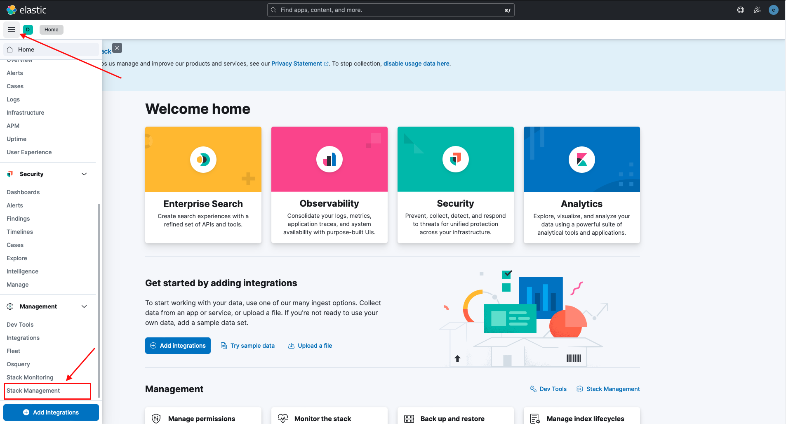
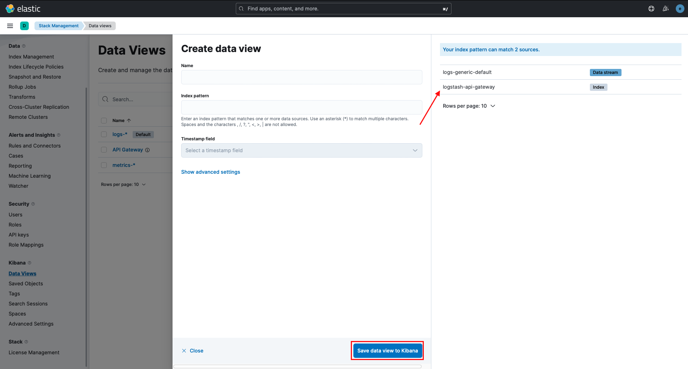
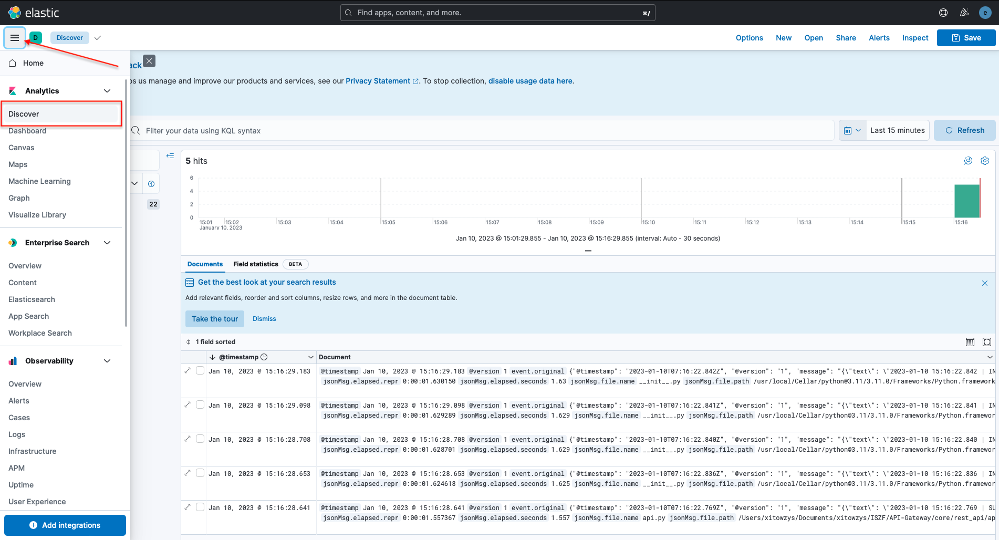
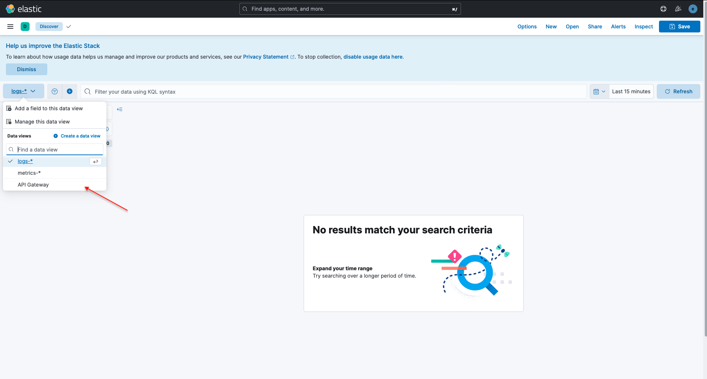
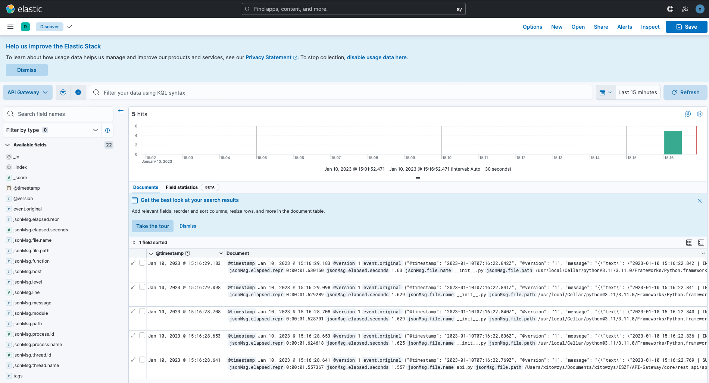

# Добавление сервиса в ELK

## 1. Настройка проекта

Чтобы добавить сервис, написанный на языке программирование Python, для начала нужно настроить сам сервис для передачи логов в logstash. 
Для этого рекомендуется использовать библиотеку [Loguru](https://github.com/Delgan/loguru). Она добавляется удобство создание логирование, подсветку для стандартной библиотеки logging и много других плюшек. Также потребуется библиотека [python-logstash](https://github.com/vklochan/python-logstash), которая добавляет обработчик для взаимодействия с logstash.

### Код для отправки логов в logstash и отображение их в консоле.
```python
import sys
import logstash
from loguru import logger

def logger_configuration() -> None:
    logger.remove()

    logger.add(logstash.TCPLogstashHandler("127.0.0.1", 50000), serialize=True, level="INFO")

    logger.add(
        sys.stdout, colorize=True, level="DEBUG",
        format="(<level>{level}</level>)({module}) [<cyan>{file}</cyan>:<cyan>{line}</cyan>] [<green>{time:HH:mm:ss}</green>] ➤ <level>{message}</level>")
        
logger_configuration()
```

Для начала нам нужно сбросить все стандартные обработчики loguru. Для этого мы прописываем `logger.remove()`.
Дальше мы добавляет для обработчика.

1. В первом мы настраимает обработчик для отправки логов в logstash через TCP соединение. 
В качестве нужных параметров мы передаем IP и порт logstash *(порт ставим такой, какой мы установили в настройках logstash)*. Также обязательно устанавливаем параметр `serialize=True` для оправки логов в JSON формате.
2. **(Для удобства)** Во втором обработчике мы настраием вывод в консоль. Для настройки формата вывода можно посмотреть в [официальной документации loguru](https://loguru.readthedocs.io/en/stable/api/logger.html)

## 2. Настройка logstash

### 2.1. Подготовка

1. Нужно зайти на сервер, где стоит logstash и перейти в директорию `cd /home/user/docker-elk/logstash/config`

2. В папке pipelines создаем файл `{название сервиса}_pipeline.conf`

3. В файле `pipelines.yml` добавляем следущие строки:

   ```yaml
   - pipeline.id: {название сервиса}
     pipeline.workers: 1
     pipeline.batch.size: 1
     path.config: "./config/pipelines/{название сервиса}_pipeline.conf"
   ```

4. Далее заходим в файл `{название сервиса}_pipeline.conf`

5. Добавляет следущее

   ```yaml
    input {
        tcp {
            port => 50000
            tags => {название сервиса}
        }
    }
   
   filter {
        if {название сервиса} in [tags] {
            json {
                source => "message"
                target => "jsonMsg"
                remove_field => "message"
            }
   
            json {
                source => "[jsonMsg][message]"
                remove_field => "[jsonMsg][message]"
            }
   
            mutate {
                remove_field => [
                    "[jsonMsg][@timestamp]", 
                    "[jsonMsg][@version]",
                    "[record][level][icon]",
                    "[record][level][name]",
                    "[record][time][repr]",
                    "[record][time][timestamp]",
                    "[record][name]",
                    "[record][level][no]",
                    "[jsonMsg][logger_name]",
                    "[jsonMsg][type]",
                    "text"
                ]
   
                rename => {
                    "[record][module]" => "[jsonMsg][module]"
                    "[record][thread][id]" => "[jsonMsg][thread][id]"
                    "[record][thread][name]" => "[jsonMsg][thread][name]"
                    "[record][message]" => "[jsonMsg][message]"
                    "[record][file][name]" => "[jsonMsg][file][name]"
                    "[record][file][path]" => "[jsonMsg][file][path]"
                    "[record][line]" => "[jsonMsg][line]"
                    "[record][function]" => "[jsonMsg][function]"
                    "[record][process][id]" => "[jsonMsg][process][id]"
                    "[record][process][name]" => "[jsonMsg][process][name]"
                    "[record][elapsed][repr]" => "[jsonMsg][elapsed][repr]"
                    "[record][elapsed][seconds]" => "[jsonMsg][elapsed][seconds]"
                }
            }
   
            mutate {
                remove_field => ["record"]
            }
        }
    }
   
   
    output {
        if {название сервиса} in [tags] {
            elasticsearch {
                hosts => "elasticsearch:9200"
                user => "logstash_internal"
                password => "${LOGSTASH_INTERNAL_PASSWORD}"
                index => "logstash-{название сервиса}"
            }
        }
    }
   ```

### 2.2. Настройка

В файле есть три поля, это input, filter и output

В **input** мы настраимает TCP порт по которому он будет принимать логи, например IP сервера 127.0.0.1, для отправки логов мы будем использовать IP с портом `127.0.0.1:50000`, также мы использует tags для избежание неприятных конфликтов с другими файлами. 

> Кроме TCP существует множество способов приема логов. Это можно посмотреть в официальной документации

В поле **output** мы настраивает отправку логов в elasticsearch. В output мы дожны настроить поле index. Обязательно нужно использовать приставку `logstash-` чтобы потом мы могли отобразить в Kibana.

Поле **filter** изменяет наши полученные логи. Существует много способов манипулировать с логами (удалять, изменять, добавлять, парсить и т.д), где описывается в официальной документации Logstash или в документациях встроенных плагинов logstash. 

> В нашем случае мы получает от loguru json логи с лишними полями. Поэтому некоторые поля удаляются с помощью `remove_field`, а некоторые просто меняют название с помощью `rename`.

## 3. Настраиваем отображение сервиса в Kibana

1. Заходим в kibana

2. Заходим в меню -> Management -> Stack Management

   |  |
   | ------------------------- |

3. Далее ищем Kibana -> Data Views и ищем кнопку Create data view

   |  |
   | ------------------------- |

4. Если все сделали правильно, то автоматически должен был появится наш индекс.

   |  |
   | ------------------------- |

   

5. В поле Name лучше написать название сервиса, а в поле Index pattern наш появившийся индекс

6. После сохранение (Save data view to Kibana) от появился во вкладке Discover 

   |  |
   | ------------------------- |
   |  |
   |  |

   